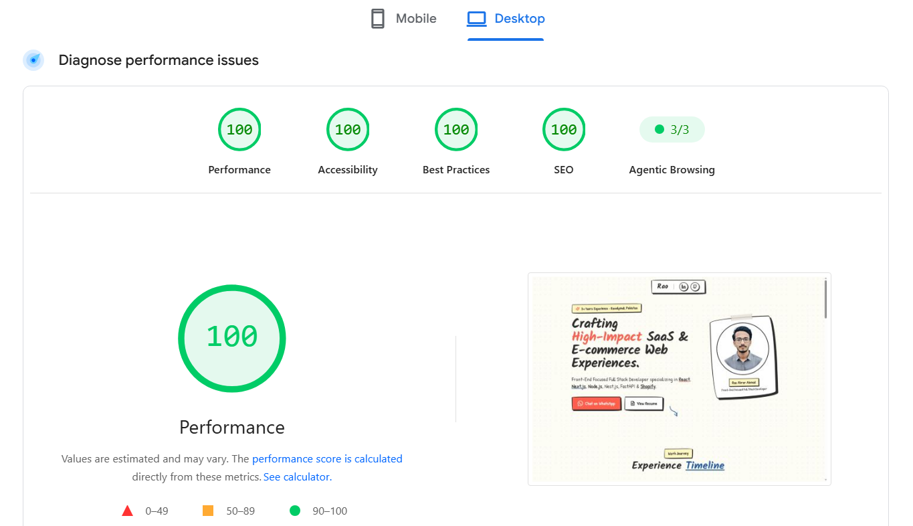

# 🎨 Next.js Hand-Drawn Developer Portfolio Template

> A 100/100 PageSpeed, 5-minute customizable, ultra-fast, SEO/AEO/GEO-optimized developer portfolio template built with **Next.js 15 (App Router)**, **TypeScript**, **Tailwind CSS**, **Framer Motion**, **GSAP + ScrollTrigger**, and automated **`llms.txt`** generation.

[](https://nextjs.org/)
[](https://www.typescriptlang.org/)
[](https://tailwindcss.com/)
[](https://pagespeed.web.dev/)
[](https://github.com/Rao-Abrar-Ahmad/Portfolio#-customization-in-5-minutes)
[](https://schema.org)
[](LICENSE)

## 

## 🌟 Why Use This Template?

Most developer portfolios look identical—sterile grid containers, generic gradients, and boilerplate components. This template rejects corporate UI in favor of a **Hand-Drawn Sketched Design System** celebrating organic imperfection, paper textures, wobbly borders, felt-tip marker typography, and hard offset shadows.

Beyond aesthetics, it is engineered for **unmatched speed, search visibility, and AI search engine discovery**:

- ⚡ **100/100 Core Web Vitals & PageSpeed**: Flawless 100/100 performance scores across Performance, Accessibility, Best Practices, and SEO.
- 🎨 **Hand-Drawn Design System**: Custom wobbly border radius algorithms, pencil black `#2d2d2d`, warm paper `#fdfbf7`, red correction marker `#ff4d4d`, blue ballpoint pen `#2d5da1`, post-it yellow `#fff9c4`, Kalam & Patrick Hand Google Fonts, paper dot texture, tape strips, and thumbtacks.
- 📜 **GSAP + ScrollTrigger Timeline**: Animated vertical squiggly dashed line that "draws itself" down the page as the user scrolls, animating experience role cards into place.
- 🔀 **Next.js App Router Intercepted Route Modals**: Clicking a project card opens `@modal/(.)projects/[slug]` as a smooth Framer Motion overlay over the grid without losing page context. Direct links or hard refreshes load `/projects/[slug]` as a standalone full page.
- 🤖 **AEO (Answer Engine Optimization) & GEO (Generative Engine Optimization)**: Multi-schema JSON-LD (`Person`, `ProfilePage`, `ItemList`, `FAQPage`) optimized to rank on Google and AI search engines (Perplexity, SearchGPT, Google AI Overviews, ChatGPT, Claude).
- 🧠 **Automated Build-Time `llms.txt` Generation**: `prebuild` hook automatically generates `/llms.txt` and `/llms-full.txt` from your data files so LLM agents can parse your portfolio context cleanly.

---

## 🚀 Quick Start

### 1. Clone & Install

```bash
# Clone the repository
git clone https://github.com/Rao-Abrar-Ahmad/Portfolio.git

# Navigate into project directory
cd Portfolio

# Install dependencies
npm install
```

### 2. Run Development Server

```bash
npm run dev
```

Open [http://localhost:3000](http://localhost:3000) in your browser to view your portfolio live.

### 3. Build for Production

```bash
npm run build
```

This automatically runs the `prebuild` hook (`npm run generate:llms`), creating fresh `/llms.txt` and `/llms-full.txt` files before compiling Next.js static pages.

---

## ⚙️ Customization (In 5 Minutes)

You can fully customize this portfolio without modifying complex layout code! All content is driven by two central configuration files:

### Step 1: Update Site Config ([`data/site.ts`](data/site.ts))

Edit `data/site.ts` to update your name, job title, bio, email, WhatsApp link, resume PDF link, and social profiles:

```typescript
export const Site = {
  name: "Your Name",
  title: "Your Name — Full Stack Developer",
  description: "Your catchy 2-line intro hook...",
  url: "https://yourdomain.com",
  location: "City, Country",
  email: "your.email@example.com",
  whatsappUrl: "https://wa.me/1234567890",
  resumePdfUrl: "https://your-hosted-resume-pdf-link.com",
  jobTitle: "Full Stack Developer",
  profilePic: "https://your-image-url.com/headshot.jpg",
  socials: {
    linkedin: "https://linkedin.com/in/yourprofile",
    github: "https://github.com/yourusername",
    twitter: "https://x.com/yourusername",
    // ...
  },
};
```

### Step 2: Update Resume & Projects ([`data/resume.ts`](data/resume.ts))

Edit `data/resume.ts` to update your work history, projects, skills, and education. `data/projects.ts` automatically re-exports from this single source of truth:

```typescript
export const resumeData = {
  summary: "Your detailed professional summary...",
  experience: [
    {
      company: "Company Name",
      role: "Senior Developer",
      period: "2023 – Present",
      location: "Remote",
      type: "Full-Time",
      bullets: ["Achievement 1", "Achievement 2"],
    },
  ],
  projects: [
    {
      slug: "my-awesome-saas",
      title: "My Awesome SaaS App",
      summary: "Short hook for project grid card...",
      description: "Full case study body...",
      stack: ["Next.js", "TypeScript", "Tailwind CSS", "Stripe"],
      metrics: ["10k+ active users", "99.9% uptime"],
      thumbnail: "https://images.unsplash.com/photo-1551288049-bebda4e38f71",
    },
  ],
  // ...
};
```

---

## 🔍 SEO, AEO & GEO Optimization Architecture

| Feature              | Implementation                                                     | Purpose                                                              |
| :------------------- | :----------------------------------------------------------------- | :------------------------------------------------------------------- |
| **Technical SEO**    | `metadataBase`, Canonical URLs, OpenGraph, Twitter Cards, Keywords | Complete Google & Bing indexing                                      |
| **Robots Policy**    | [`app/robots.ts`](app/robots.ts)                                   | Unrestricted crawling for `GPTBot`, `ClaudeBot`, `PerplexityBot`     |
| **Dynamic Sitemap**  | [`app/sitemap.ts`](app/sitemap.ts)                                 | Auto-generates `/sitemap.xml` for all static & project detail routes |
| **AI Context Files** | [`scripts/generate-llms.ts`](scripts/generate-llms.ts)             | Automatically outputs `/llms.txt` and `/llms-full.txt` during build  |
| **Structured Data**  | [`components/PersonSchema.tsx`](components/PersonSchema.tsx)       | `Person`, `ProfilePage`, `ItemList`, and `FAQPage` JSON-LD schemas   |

---

## 📁 Repository Structure

```
├── app/
│   ├── layout.tsx                     # Fonts (Kalam & Patrick Hand), global styles, metadata, @modal slot
│   ├── page.tsx                       # Main landing page (Header, Hero, Experience, Projects, Contact)
│   ├── globals.css                    # Hand-drawn wobbly utilities, paper dot texture, hard shadows
│   ├── robots.ts                      # Dynamic robots.txt output
│   ├── sitemap.ts                     # Dynamic sitemap.xml output
│   ├── @modal/
│   │   └── (.)projects/[slug]/page.tsx# Intercepted project route overlay modal
│   └── projects/[slug]/page.tsx       # Standalone project detail page
├── components/
│   ├── Header.tsx                     # Minimal header with enclosed social icons
│   ├── Hero.tsx                       # Hero copy, CTAs, tape-mounted headshot frame
│   ├── ExperienceTimeline.tsx         # GSAP + ScrollTrigger line draw-in & role cards
│   ├── ProjectGrid.tsx                # Interactive grid with post-it yellow & tape/tack variants
│   ├── ProjectCard.tsx                # Card component with hover jiggle effect
│   ├── ProjectDetail.tsx              # 2-column detail view (sticky left info, stacked right gallery)
│   ├── ProjectModal.tsx               # Framer Motion backdrop & modal overlay container
│   ├── Contact.tsx                    # Contact section with email, WhatsApp, and social links
│   ├── HandDrawnDecorations.tsx      # SVG Tape, Thumbtack, Wavy Underline, Scribbled Arrow primitives
│   └── PersonSchema.tsx               # JSON-LD Schema.org structured data (Person, FAQ, ItemList)
├── data/
│   ├── site.ts                        # Master site metadata & social links
│   ├── resume.ts                      # Master resume, experience, skills, and projects data
│   └── projects.ts                    # Re-exports projects from resume.ts (Single Source of Truth)
├── scripts/
│   └── generate-llms.ts               # Build-time script generating llms.txt & llms-full.txt
├── public/
│   ├── favicon.ico
│   ├── pagespeed.png                  # 100/100 PageSpeed audit screenshot
│   ├── llms.txt                       # Generated AI agent context summary
│   └── llms-full.txt                  # Generated AI deep-dive documentation
├── package.json
├── tailwind.config.ts                 # Hand-Drawn design system tokens (colors, shadows, fonts)
└── tsconfig.json
```

---

## 🌐 Deploying to Production

### Deploy on Vercel (Recommended)

The easiest way to deploy your portfolio is using [Vercel](https://vercel.com):

1. Push your repository to GitHub.
2. Import the project into Vercel.
3. Vercel automatically detects Next.js, executes `npm run build` (including the `prebuild` LLM generator hook), and deploys instantly!

---

## 📄 License

Distributed under the **MIT License**. See [`LICENSE`](LICENSE) for more information.

---

<p center>
Crafted with ❤️ by <a href="https://github.com/Rao-Abrar-Ahmad">Rao Abrar Ahmad</a>. If you find this template helpful, please give it a ⭐️ on GitHub!
</p>
